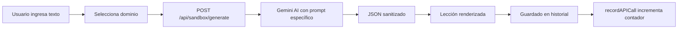

# 🏛️ ARQUITECTURA VIVA v19.3 - AI Code Mentor

**Fecha:** 2025-12-08  
**Cambio Principal:** Sandbox Improvements - Dominio Contextual, Historial, API Counter Local  
**Versión Anterior:** v19.2 (Multi-Domain & Plugins)

---

## 🗂️ FUENTES DE VERDAD v19.3

### Documentación Arquitectónica

**ACTIVA (v19.3):**
1. ✅ **ARQUITECTURA_VIVA v19.3** (este documento) → **LÍNEA BASE ACTUAL**
2. 📚 **ARQUITECTURA_VIVA v19.2** → REFERENCIA (Multi-Domain & Plugins)
3. ✅ **docs/DOMAIN_TEST_SAMPLES.md** → NUEVO (Muestras de test por dominio) 🆕
4. ✅ **Contrato de API v2.1** → VIGENTE

---

## 📖 DIFERENCIAS ENTRE v19.2 Y v19.3

### Cambio: UX Sandbox Mejorada

**Por qué es v19.3 (Patch):**

Mejoras de UX y estabilidad en el módulo Sandbox:

- Selector de dominio **movido al Sandbox** (era global en header)
- Historial de lecciones **funcional** (fix auth 401 → 200)
- API Counter **reset por fecha local** (era Pacific Time)
- JSON Sanitization **robusto** (múltiples estrategias)

### 🔄 Componentes Modificados

#### Selector de Dominio - Reubicado
```
ANTES (v19.2):
components/layout/PrivateLayout.js → Header global

AHORA (v19.3):
components/Sandbox/SandboxWidget.js → Dentro del Sandbox
  └── Contexto claro para el alumno
  └── Evita confusión con otras secciones
```

#### Historial de Lecciones - Fix Auth
```
components/Sandbox/SandboxWidget.js
  └── saveToHistory() → credentials: 'include' (cookies)
  └── Antes: Bearer token (internalToken) → 401
  └── Ahora: Supabase cookies → 200 ✅
```

#### API Counter - Reset Local
```
contexts/APITrackingContext.js
  └── calculateNextResetTime() → Medianoche LOCAL
  └── Antes: Pacific Time (confuso para usuarios no-US)
  └── Ahora: 00:00-23:59 hora local del usuario
```

#### JSON Sanitization - Multi-Estrategia
```
pages/api/sandbox/generate.js
  └── 3 estrategias de sanitización cascada:
      1. Regex extraction
      2. Newline escaping
      3. Aggressive character replacement
  └── Fallback con título si parsing falla
  └── Post-processing: \\n → newlines reales
```

---

## 🧪 Sandbox Widget v19.3

### UI Mejorada

| Elemento | Ubicación | Función |
|----------|-----------|---------|
| **Selector Dominio** | Top del formulario | Personaliza prompt IA |
| **Textarea** | Área principal | Contenido a procesar |
| **API Counter** | Sidebar izquierdo | Tracking local |
| **Historial** | Panel derecho | Últimas 20 lecciones |

### Flujo de Generación



---

## 🎯 Dominios Soportados

| Dominio | Icono | Prompt Focus |
|---------|-------|--------------|
| Programming | 🖥️ | Algoritmos, patrones, tipos de datos |
| Logic | 🧠 | Silogismos, proposiciones, tablas de verdad |
| Databases | 🗄️ | Normalización, SQL, modelo ER |
| Math | 📐 | Teoremas, demostraciones, fórmulas |

---

## ✅ Certificación v19.3

### Checklist Mejoras Sandbox

- [x] Selector de dominio movido a SandboxWidget
- [x] Historial guardando correctamente (401 → 200)
- [x] API Counter con reset de fecha local
- [x] JSON sanitization multi-estrategia
- [x] Post-processing para newlines
- [x] Fallback response si parsing falla

### Archivos Modificados

| Archivo | Cambio |
|---------|--------|
| `components/Sandbox/SandboxWidget.js` | Selector dominio, credentials include, recordAPICall |
| `components/layout/PrivateLayout.js` | Removido selector de dominio del header |
| `contexts/APITrackingContext.js` | Reset hora local |
| `pages/api/sandbox/generate.js` | JSON sanitization robusta |
| `docs/DOMAIN_TEST_SAMPLES.md` | Textos de ejemplo por dominio |

### Build Status
- ✅ `npm run build` - Exit code 0
- ✅ Sandbox funcionando con dominios
- ✅ Historial persistiendo en Supabase
- ✅ API Counter sincronizado

---

## 📚 Referencias

- [ARQUITECTURA_VIVA_v19.2.md](./ARQUITECTURA_VIVA_v19.2.md)
- [docs/DOMAIN_TEST_SAMPLES.md](../docs/DOMAIN_TEST_SAMPLES.md)

---

> **Nota:** v19.3 es un patch de UX sobre v19.2. No altera la arquitectura de plugins ni multi-dominio, solo mejora la experiencia de uso del Sandbox.
