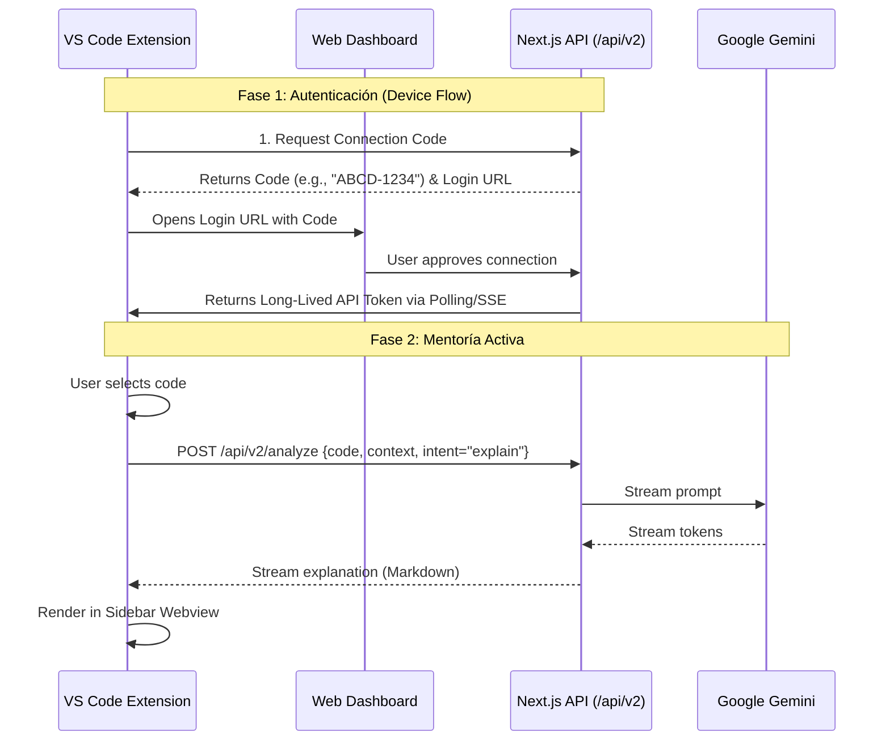

# Especificación de Diseño: Extensión VS Code "AI Code Mentor"

## 1. Visión General
El objetivo es llevar la capacidad de mentoría de la plataforma web directamente al entorno de desarrollo (IDE) del estudiante. La extensión actuará como un "cliente" que consulta a la "API cerebro" (nuestra app Next.js).

## 2. Arquitectura de Alto Nivel



## 3. Componentes Clave

### A. Autenticación (Sin compartir contraseñas)
No pediremos al usuario que meta su contraseña en VS Code. Usaremos un **Device Authorization Flow** (similar a cuando conectas YouTube en una TV):
1. La extensión genera un código temporal.
2. Te manda a `ai-mentor.com/connect` para autorizar.
3. El servidor emite un `Personal Access Token (PAT)` que la extensión guarda de forma segura.

### B. Comandos Principales
La extensión registrará los siguientes comandos en la paleta (`Ctrl+Shift+P`):
*   `AI Mentor: Explain Selection`: Explica *por qué* funciona el código seleccionado.
*   `AI Mentor: Review Best Practices`: Audita contra las reglas IRP.
*   `AI Mentor: Generate Tests`: Crea tests unitarios para la función seleccionada.

### C. Interfaz de Usuario (UI)
*   **Sidebar Chat**: Para preguntas conversacionales ("¿Cómo mejoro este loop?").
*   **Code Lenses**: Texto pequeño sobre funciones complejas ("Click para explicar").
*   **Inline Diff**: Para mostrar sugerencias de refactorización visualmente.

## 4. API Contract (Draft)

### Endpoint: `POST /api/ext/analyze`
```json
{
  "codeSnippet": "function add(a,b) { return a+b }",
  "filePath": "src/utils/math.js",
  "language": "javascript",
  "lineRange": [10, 12],
  "intent": "refactor | explain | review",
  "projectContext": {
    "framework": "nextjs",
    "dependencies": ["lodash", "axios"]
  }
}
```

## 5. Implementación (Roadmap Técnico)

1.  **Fase 1 (Backend Support)**: Crear los endpoints de API necesarios en nuestra app Next.js (`/api/ext/*`).
2.  **Fase 2 (Auth Bridge)**: Implementar el flujo de conexión seguro.
3.  **Fase 3 (Extension Client)**: Crear el proyecto Yeoman para VS Code y conectar los cables.
